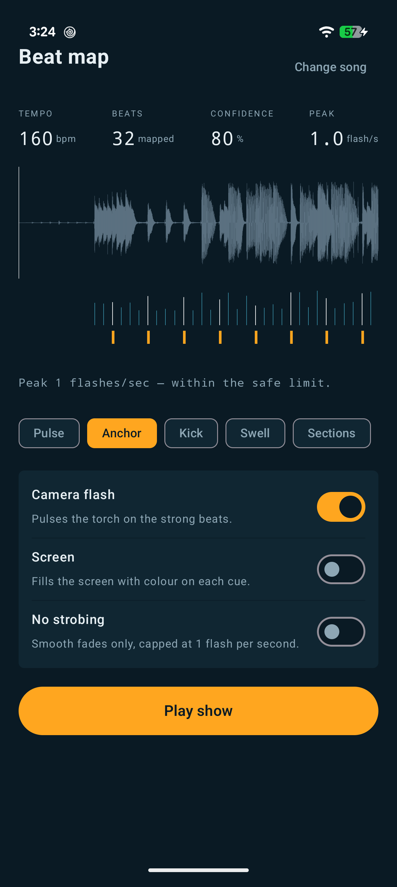

# TuneSync

Turn a crowd into a lighting rig.

TuneSync analyses a song on your Android device, extracts a beat map with the vocals stripped out of the analysis, and drives the phone's torch, screen and haptics from it — in time with the music, with no server, no network and no account.

**Status:** Phase 1 (offline workbench) is built and running. Phase 2 (live sync by fingerprint alignment) is built and passing its host tests, but has not yet been validated against a real PA. Phase 3 is specified but not started. See [Roadmap](#roadmap).

<p align="center">
  
</p>

<p align="center"><em>The beat map screen. Three lanes over one timebase: the audio, the beats found in it, and the cues that will actually fire — so the mapping is visible rather than asserted. The peak flash rate is shown because designers should see the safety number, not trust a promise.</em></p>

---

## What it does today

1. **Import** a song you own, through the system document picker.
2. **Analyse** it on-device: harmonic/percussive separation, onset detection, tempo estimation, beat tracking, per-beat salience scoring.
3. **Show you the map** — waveform, beat grid and the actual cue timeline in three synchronised lanes, so the mapping is visible rather than asserted.
4. **Run the show** against local playback, driving the torch and a full-screen colour panel in time.

5. **Or follow a live source** — play that track on any speaker nearby and the phone finds its place in the song by ear, then runs the show in time with the room.

Everything runs offline. The app requests **no camera permission** (torch control doesn't need one), **no media permission** (the document picker doesn't need one), and **no internet permission at all**. The microphone is asked for only when you choose to listen, and captured audio is never recorded, never saved and never leaves the device.

## Following a live source

Phase 2 is deliberately *not* song identification. The track was imported by the user, so the only unknown is **where in it the room currently is** — a far easier problem than Shazam solves, and one that fits entirely on the phone with a single-track index.

```
mic ──▶ 4 s window ──▶ spectral peaks ──▶ peak-pair hashes
                                                │
              reference index (built at import) │
                                                ▼
                                    offset histogram ──▶ drift filter ──▶ scheduler
                                                             │
                              predicted position narrows the next search to ±2 s
```

Once locked, the matcher only has to *confirm* a predicted position rather than search the whole track, which is what makes a twice-a-second re-lock affordable. The drift filter recovers both offset and **rate**, so it tracks a DJ running the track off-speed as well as ordinary crystal drift, and it keeps predicting through a gap — a crowd roar over one chorus must not kill the show.

Two properties worth knowing:

- **Repetitive material is genuinely ambiguous.** On a loop, several offsets a bar apart are all correct. The matcher cannot resolve that and does not try; temporal continuity in the drift filter does.
- **It will not follow a live band.** A band playing the song on stage is a different recording — different tempo, different arrangement — and the fingerprints will not match. Phase 2 is for walk-out music, DJ sets, arena playlists and anything played from a known recording. Live performance needs the Phase 3 ultrasonic tier.

## How the analysis works

You don't remove vocals to find the beat — you keep only the percussion. Vocals, guitars, pads and bass hold pitch, so they draw horizontal lines across a spectrogram. Drums are broadband transients, so they draw vertical ones. Median-filtering along each axis pulls them apart, and the percussive residue is exactly what a beat tracker wants.

```
PCM ──▶ STFT ──┬──▶ median over time ──▶ harmonic  (vocals, bass, pads) ──▶ discarded
   (centred)   │
               └──▶ median over freq ──▶ percussive ──▶ spectral flux ──▶ tempo ──▶ beat track ──▶ beat map
```

Measured on synthetic fixtures: separation retains **0.7%** of a sustained vocal against **98.3%** of drums, and the onset envelope is **0.999** correlated with and without a vocal present.

No ML model ships with the app. The whole pipeline is ~1,500 lines of plain Kotlin over primitive arrays.

## Architecture

| Module | Type | Contains |
| --- | --- | --- |
| `:core:model` | Plain JVM | Beat map schema, cue types, show compiler. No Android types, so it stays portable. |
| `:core:dsp` | Plain JVM | FFT, STFT, HPSS, onset detection, tempo, beat tracking, salience. Host-tested in CI. |
| `:core:safety` | Plain JVM | The flash limiter. Its own module so it cannot be casually bypassed. |
| `:core:output` | Android lib | Torch driver, haptics, device profile, the show scheduler. |
| `:core:listen` | Android lib | Microphone capture and live alignment. Phase 2. |
| `:app` | Android app | Audio decode and playback, foreground service, Compose UI. |

The dependency rule that matters: **the show runner cannot construct a cue list that hasn't passed the flash limiter.** The compiler emits `UnsafeCueList`; only `:core:safety` can turn one into the `ArmedShow` the runner accepts. That's enforced by the type system, not by convention.

## Safety

Flashing lights can trigger seizures in people with photosensitive epilepsy, and a torch LED in a dark room is the highest-contrast case there is. This is treated as a hard constraint, not a compliance checkbox.

- **3.0 Hz ceiling** on any rolling 1-second window, per WCAG 2.3.1. 3 Hz is exactly 180 BPM, so this is a code path that fires on real music.
- **Two independent gates.** The compiler enforces it, and the scheduler re-verifies immediately before output starts. One gate can be bypassed by a bug; two are much less likely to be.
- **Rate is measured in perceived flashes**, not cues — the torch and screen firing on the same beat count once, and when an instant must be dropped, every channel in it goes together.
- **Weakest cues go first.** Naive every-other-cue decimation would be equally safe and rhythmically wrong.
- Mandatory consent before the first show, a one-tap no-strobe mode, and a panic stop bound to both a screen tap and the volume keys.
- The compiled show's **peak flash rate is displayed in the UI** — designers should see the number, not trust a promise.

The limiter is verified by property tests across every tempo from 40 to 300 BPM and 400 randomly generated cue lists.

## Building

Requires JDK 17+ and the Android SDK (compileSdk 35). Android Studio's bundled JBR works:

```bash
# Windows
set JAVA_HOME=C:\Program Files\Android\Android Studio\jbr
gradlew.bat test          # 41 tests, all host-side, no device needed
gradlew.bat assembleDebug
```

```bash
# macOS / Linux
./gradlew test
./gradlew assembleDebug
```

`local.properties` is not committed; create it with `sdk.dir=/path/to/Android/Sdk` or let Android Studio generate it.

**Measured:** a four-minute track analyses in ~2 s on a desktop host against an 8 s target. Release APK is 1.87 MB.

## Testing

All tests run on the JVM without an emulator. The DSP is validated against synthetic drum patterns with sample-accurate ground truth:

| Suite | Covers |
| --- | --- |
| `BeatAnalyzerTest` | Tempo recovery 70–174 BPM, beat F-measure ≥ 0.90 at ±70 ms, downbeats, noise tolerance, honest refusal on beatless material |
| `ChainLatencyTest` | Group delay of the STFT + flux chain, measured with isolated impulses |
| `HpssTest` | Separation actually favours drums over a sustained vocal |
| `FingerprintTest` | Locating an excerpt to within a frame, under noise and a 4× level drop; rejecting foreign audio; constrained re-lock |
| `DriftTrackerTest` | Rate recovery, outlier rejection, re-seek after a skip, coast-then-lose |
| `FlashLimiterTest` | The safety cap, across every tempo and 400 random cue lists |
| `TrackPlayerBufferTest` | Audio buffer frame alignment across nine sample rates |

`TempoDiagnosticTest` and `GridDiagnosticTest` are printouts rather than assertions, kept in the repo for re-deriving the calibration constants. See [docs/ENGINEERING-NOTES.md](docs/ENGINEERING-NOTES.md).

## Roadmap

| Phase | Ships | State |
| --- | --- | --- |
| **1 — Workbench** | Import, map, visualise, run against local playback | Built |
| **2 — Listen** | Point the phone at a PA playing a track you've mapped; fingerprint alignment recovers playback position and the show follows | Built, not yet field-tested |
| **3 — Venue** | Ultrasonic data-over-audio tier for venues, operator console, UDP/OSC triggers | Specified |

Not yet built, in rough order of usefulness: a **library** of mapped tracks (today one track lives in memory at a time), the **beat map editor** (offset nudge, tap tempo, half/double — `BeatAnalyzer.rescale` exists and is tested but has no UI), and **section detection** for per-section intensity.

## Documentation

- **[Product requirements](https://omkarkadam01.github.io/tunesync/prd.html)** — the full PRD: competitive analysis, phase scope, the latency budget, ~55 edge cases by subsystem, device fragmentation, risks. ([source](docs/prd.html))
- **[Engineering notes](docs/ENGINEERING-NOTES.md)** — the measured calibration constants, and the bugs worth remembering.

## Non-goals

- **Playing DRM-protected streams.** Spotify and Apple Music files aren't readable by third-party apps. TuneSync imports files you own.
- **Identifying a song it has never seen.** That's an ACR service and a licensing relationship.
- **Being a music player.** Playback exists to rehearse the show.
- **Exceeding the flash ceiling for artistic reasons.** Not negotiable at any tier.

## Licence

Not yet chosen.
